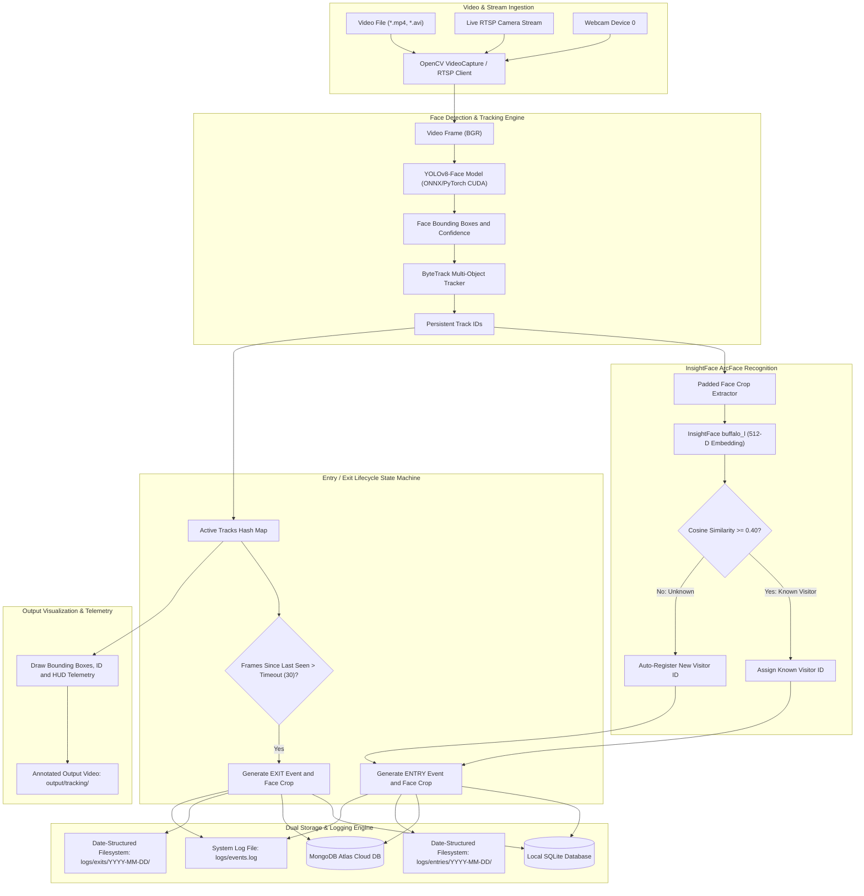

# AI Planning Document & Application Architecture

## 1. Problem Overview
The **Intelligent Face Tracker with Auto-Registration and Visitor Counting** system is built to solve continuous real-time video surveillance challenges:
- High accuracy real-time face detection under varying illumination, head poses, and motion blur.
- Consistent cross-frame object association (tracking across frames).
- Face feature extraction using state-of-the-art Deep Face Recognition representations (512-D ArcFace / InsightFace embeddings).
- Dynamic auto-registration of unknown visitors without manual enrollment.
- Robust cross-session and cross-camera Re-Identification (Re-ID) to ensure unique visitor tallies never increment upon return visits.
- Event logging for Entry and Exit with date-partitioned timestamped face crops.
- Persistent structured data logging across dual storage engines: **SQLite** (local guaranteed offline persistence) and **MongoDB Atlas** (cloud synchronization).
- Seamless switching between pre-recorded surveillance videos and live RTSP camera streams.

---

## 2. System Architecture

---

## 3. Modular Pipeline Design

1. **`src/detection/face_detector.py`**:
   - High-throughput batch inference pipeline for face localization.
   - Evaluates frame-skip strategies and detection confidence thresholds.

2. **`src/tracking/face_tracker.py`**:
   - Integrates ByteTrack with YOLO bounding box representations.
   - Maintains continuous motion trajectories and trajectory CSV reports.

3. **`src/recognition/face_recognizer.py`**:
   - Implements InsightFace `buffalo_l` (ResNet50 / ArcFace backbone).
   - Generates normalized 512-dimensional facial feature vectors.
   - Computes Cosine Similarity metric:
     $$\text{Cosine Similarity} = \frac{\mathbf{u} \cdot \mathbf{v}}{\|\mathbf{u}\|_2 \|\mathbf{v}\|_2}$$

4. **`src/database/db_manager.py`**:
   - Dual-engine transactional logging for SQLite and MongoDB Atlas.
   - Automatic table schema creation (`visitors`, `events`).
   - In-memory visitor pre-loading on startup for immediate cross-run re-identification.

5. **`main.py`**:
   - Unified real-time orchestration engine.
   - Handles video folder ingestion, live RTSP streams, and webcams.
   - Coordinates dynamic auto-registration, entry/exit logging, crop archiving, and video rendering.

---

## 4. State Machine: Visitor Lifecycle

- **STATE 1: NEW DETECTION**
  - Track ID assigned by ByteTrack.
  - Bounding box padded by 25% to capture full facial context.
  - 512-D embedding extracted via InsightFace.

- **STATE 2: RE-IDENTIFICATION CHECK**
  - Comparison against loaded visitor database.
  - If $\max(\text{similarity}) \ge 0.40$: Identified as existing visitor.
  - If $\max(\text{similarity}) < 0.40$: New visitor ID allocated (`VISITOR_XXXX`).

- **STATE 3: ENTRY EVENT DISPATCH**
  - Face crop saved to `logs/entries/YYYY-MM-DD/<visitor_id>_entry.jpg`.
  - Transaction written to `events` table (Type: `ENTRY`).
  - Recorded in `logs/events.log`.

- **STATE 4: CONTINUOUS TRACKING**
  - Position updated per frame; real-time telemetry HUD rendered.

- **STATE 5: EXIT EVENT DISPATCH**
  - Triggered when track is missing for $\ge 30$ consecutive frames or video reaches EOF.
  - Face crop saved to `logs/exits/YYYY-MM-DD/<visitor_id>_exit.jpg`.
  - Transaction written to `events` table (Type: `EXIT`).
  - Memory cleanup of active track metadata.
